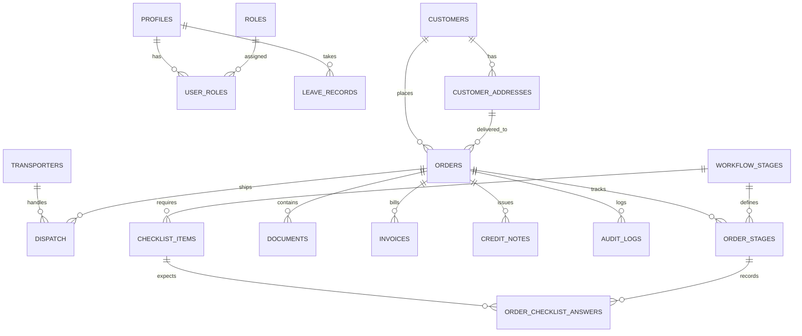

# Database Specification

This document details the normalized Supabase PostgreSQL schema derived from the Google Sheets FMS. It separates master data, transactional records, and workflow execution into distinct entities.

## Entity Relationship Diagram

---

## 1. Authentication & Authorization

### `roles`
**Purpose:** Predefined system roles (Admin, MIS, CA, Pricelist, Create).
- **Columns:**
  - `id` (UUID, PK)
  - `name` (Text, Unique) - e.g., 'Admin', 'MIS'
  - `description` (Text)
- **RLS:** Public read, MIS insert/update.

### `profiles`
**Purpose:** Extends `auth.users` with business information (Salesman details).
- **Columns:**
  - `id` (UUID, PK, FK -> `auth.users.id`)
  - `full_name` (Text)
  - `email` (Text)
  - `whatsapp_id` (Text, nullable)
- **RLS:** Public read, User can update own record.

### `user_roles`
**Purpose:** Associates users with specific business roles.
- **Columns:**
  - `id` (UUID, PK)
  - `user_id` (UUID, FK -> `profiles.id`)
  - `role_id` (UUID, FK -> `roles.id`)
- **Indexes:** `idx_user_roles_user_id`
- **Unique Constraint:** `(user_id, role_id)`
- **RLS:** MIS full access.

### `leave_records`
**Purpose:** Tracks employee leaves to pause TAT SLA assignment (Replaces `Doer Leave` sheet).
- **Columns:**
  - `id` (UUID, PK)
  - `user_id` (UUID, FK -> `profiles.id`)
  - `start_date` (Date, Not Null)
  - `end_date` (Date, Not Null)
- **RLS:** MIS/Admin full access, User read own.

---

## 2. Master Data Configuration

### `customers`
**Purpose:** Master list of customers (Replaces `Dropdown` customer data).
- **Columns:**
  - `id` (UUID, PK)
  - `customer_code` (Text, Unique, Not Null)
  - `name` (Text, Not Null)
  - `email` (Text)
  - `is_special` (Boolean, Default false) - Triggers Special Stg
  - `default_salesman_id` (UUID, FK -> `profiles.id`, nullable)
- **Indexes:** `idx_customers_name`
- **RLS:** MIS/Admin write, Authenticated read.

### `customer_addresses`
**Purpose:** Normalizes the "Delivery 1-4" mapping.
- **Columns:**
  - `id` (UUID, PK)
  - `customer_id` (UUID, FK -> `customers.id`)
  - `address_code` (Text) - e.g., `AT1-Delivery 1`
  - `address_text` (Text, Not Null)
- **Unique Constraint:** `(customer_id, address_code)`
- **RLS:** MIS/Admin write, Authenticated read.

### `transporters`
**Purpose:** Master logistics partners (e.g., TCI, DIRECT, DTDC).
- **Columns:**
  - `id` (UUID, PK)
  - `name` (Text, Unique, Not Null)
  - `type` (Text) - e.g., 'DIRECT', 'AUTO', 'STANDARD'
- **RLS:** MIS write, Authenticated read.

### `holidays`
**Purpose:** Explicit non-working dates for TAT math.
- **Columns:**
  - `id` (UUID, PK)
  - `holiday_date` (Date, Unique, Not Null)
  - `description` (Text)
- **RLS:** MIS write, Authenticated read.

---

## 3. Workflow Engine Definition

### `workflow_stages`
**Purpose:** Defines the static workflow sequence and TAT rules (Replaces `Settings` TAT config).
- **Columns:**
  - `id` (UUID, PK)
  - `stage_name` (Text, Unique) - e.g., 'PI Entry', 'Admin Approval'
  - `sequence_order` (Integer, Not Null)
  - `tat_hours` (Integer, Default 1)
  - `responsible_role_id` (UUID, FK -> `roles.id`)
- **RLS:** MIS write, Authenticated read.

### `checklist_items`
**Purpose:** Defines the mandatory questions/validations per stage.
- **Columns:**
  - `id` (UUID, PK)
  - `stage_id` (UUID, FK -> `workflow_stages.id`)
  - `question_text` (Text, Not Null)
  - `is_required` (Boolean, Default true)
  - `expected_type` (Text) - e.g., 'boolean', 'text', 'document'
- **RLS:** MIS write, Authenticated read.

---

## 4. Transactional Data (Orders & Operations)

### `orders`
**Purpose:** Core central entity representing an active submission (Replaces `Data` sheet base).
- **Columns:**
  - `id` (UUID, PK)
  - `submission_id` (Text, Unique, Not Null) - Maps to old form ID, prevents duplicates
  - `customer_id` (UUID, FK -> `customers.id`, Not Null)
  - `delivery_address_id` (UUID, FK -> `customer_addresses.id`, Not Null)
  - `created_at` (Timestamptz, Default NOW())
  - `status` (Text, Default 'Active') - 'Active', 'Cancelled'
  - `is_archived` (Boolean, Default false)
  - `cn_applicable` (Boolean, Default false)
- **Indexes:** `idx_orders_submission`, `idx_orders_customer`
- **RLS:** Users with `Create` role can insert. All authenticated can read.

### `order_stages`
**Purpose:** Tracks the lifecycle of an order across the workflow (Replaces `Current Stage`).
- **Columns:**
  - `id` (UUID, PK)
  - `order_id` (UUID, FK -> `orders.id`, Not Null)
  - `stage_id` (UUID, FK -> `workflow_stages.id`, Not Null)
  - `status` (Text, Default 'Pending') - 'Pending', 'Done', 'Rejected'
  - `planned_date` (Timestamptz) - Calculated via SLA
  - `actual_date` (Timestamptz, nullable)
  - `completed_by` (UUID, FK -> `profiles.id`, nullable)
- **Unique Constraint:** `(order_id, stage_id)`
- **Indexes:** `idx_order_stages_status`
- **RLS:** Update restricted to users holding the `responsible_role_id` for this `stage_id`.

### `order_checklist_answers`
**Purpose:** Stores specific form data responses (Replaces `checklist` sheet).
- **Columns:**
  - `id` (UUID, PK)
  - `order_stage_id` (UUID, FK -> `order_stages.id`)
  - `item_id` (UUID, FK -> `checklist_items.id`)
  - `response_value` (Text, nullable)
- **RLS:** Users capable of updating `order_stages` can insert/update.

---

## 5. Sub-Domain Entities

### `dispatch`
**Purpose:** Separates logistical data (Replaces columns from `IDS` / `Data`).
- **Columns:**
  - `id` (UUID, PK)
  - `order_id` (UUID, FK -> `orders.id`, Unique)
  - `transporter_id` (UUID, FK -> `transporters.id`, Not Null)
  - `vehicle_number` (Text)
  - `driver_contact` (Text)
  - `weight_kg` (Decimal)
  - `advance_amount` (Decimal)
- **RLS:** Dispatch/SC roles write access.

### `invoices`
**Purpose:** Separates financial/billing documentation.
- **Columns:**
  - `id` (UUID, PK)
  - `order_id` (UUID, FK -> `orders.id`, Unique)
  - `invoice_number` (Text, Unique)
  - `invoice_amount` (Decimal, Not Null)
  - `quantity` (Integer)
  - `docket_no` (Text)
  - `eway_bill_expiry` (Date)
- **RLS:** Admin/CA roles write access.

### `credit_notes`
**Purpose:** Conditional CN data (Replaces CN logic in `Data`).
- **Columns:**
  - `id` (UUID, PK)
  - `order_id` (UUID, FK -> `orders.id`)
  - `remark` (Text)
  - `approval_status` (Text, Default 'Pending')
- **RLS:** Admin/CA roles write access.

### `documents`
**Purpose:** Manages Supabase Storage references uniformly (Gatepass, Invoice PDF, Bilty).
- **Columns:**
  - `id` (UUID, PK)
  - `order_id` (UUID, FK -> `orders.id`, Not Null)
  - `document_type` (Text, Not Null) - e.g., 'Gatepass', 'Invoice', 'Summary'
  - `storage_path` (Text, Not Null) - Format must be a valid path
  - `uploaded_at` (Timestamptz, Default NOW())
  - `uploaded_by` (UUID, FK -> `profiles.id`)
- **Check Constraint:** `storage_path` must not be null/empty.
- **RLS:** Auth users can insert; Public read (or authenticated read depending on privacy).

### `audit_logs`
**Purpose:** Tracks critical state changes for compliance.
- **Columns:**
  - `id` (UUID, PK)
  - `order_id` (UUID, FK -> `orders.id`)
  - `user_id` (UUID, FK -> `profiles.id`)
  - `action` (Text) - e.g., 'STAGE_APPROVED', 'PRICE_MISMATCH_OVERRIDE'
  - `old_state` (JSONB)
  - `new_state` (JSONB)
  - `created_at` (Timestamptz, Default NOW())
- **RLS:** Insert only (via database triggers), MIS read.
